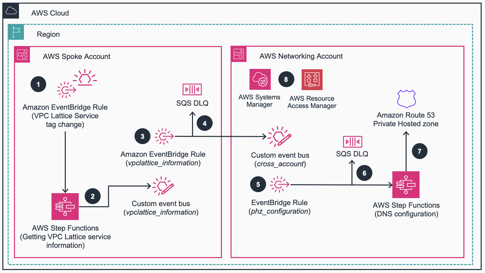

# Guidance for VPC Lattice automated DNS configuration on AWS

This guidance automates the creation of DNS (Domain Name System) resolution configuration in [Amazon Route 53](https://aws.amazon.com/route53/) when creating new [Amazon VPC Lattice](https://aws.amazon.com/vpc/lattice/) services with custom domain names.

## Table of Contents

1. [Overview](#overview)
    - [Architecture](#architecture-overview)
    - [AWS services used in this Guidance](#aws-services-used-in-this-guidance)
    - [Cost](#cost)
2. [Prerequisites](#prerequisites)
    - [Operating System](#operating-system)
    - [Third-party tools](#third-party-tools)
    - [AWS Account requirements](#aws-account-requirements)
    - [Service quotas](#service-quotas)
3. [Security](#security)
    - [Encryption at rest](#encryption-at-rest)
4. [Deploy the Guidance](#deploy-the-guidance)
5. [License](#license)
6. [Contributing](#contributing)

## Overview

[Amazon VPC Lattice](https://aws.amazon.com/vpc/lattice/) is an application networking service that simplifies connectivity, monitoring, and security between your services. Its main benefits are the configuration and management simplification, allowing developers to focus on building features while Networking & Security administrators can provide guardrails in the services’ communication. The service simplifies the onboarding experience for developers by removing the need to implement custom application code, or run additional proxies next to every workload, while maintaining the tools and controls network admins require to audit and secure their environment. VPC Lattice leverages [Domain Name System (DNS)](https://aws.amazon.com/route53/what-is-dns/) for service discovery, so each VPC Lattice service is easily identifiable through its service-managed or custom domain names. However, for custom domain names, extra manual configuration is needed to allow DNS resolution for the consumer workloads.

This guidance automates the configuration of DNS resolution anytime a new VPC Lattice service (with a custom domain name configured) is created. For more information about how the guidance is implemented, check the [Implementation Guide](https://aws-solutions-library-samples.github.io/networking/amazon-vpc-lattice-automated-dns-configuration-on-aws.html).

### Features and benefits 

This guidance provides the following features:

1. **Seamless service discovery with VPC Lattice when using custom domain names**. 
    * All the DNS resolution is configured in the Private Hosted Zone you desire.
    * Anytime a VPC Lattice service is created/deleted in any AWS Account, its DNS information (custom and service-managed domain names for created resources) is sent to the AWS Account managing the DNS configuration. This message is processed by creating/deleting an [Alias record](https://docs.aws.amazon.com/Route53/latest/DeveloperGuide/resource-record-sets-choosing-alias-non-alias.html).

2. **Automation resources are built using Infrastructure-as-Code**.
    * [AWS CloudFormation](https://aws.amazon.com/cloudformation/) or [Hashicorp Terraform](https://www.terraform.io/) are used as options for the guidance automated code deployment.
    * Given this automation is built for multi-account environments, detailed deployment steps are provided in the [Deploy the Guidance](#deploy-the-guidance) section.

### Use cases

While VPC Lattice can be used in a single Account, the most common use case is the use of the service in multi-Account environments. With VPC Lattice, two are the main resources to be used: the [VPC Lattice service network](https://docs.aws.amazon.com/vpc-lattice/latest/ug/service-networks.html) is the logical boundary that connects consumers and producers, and the [VPC Lattice service](https://docs.aws.amazon.com/vpc-lattice/latest/ug/services.html) is the independently deployable unit of software that delivers a task or function (the application). The multi-Account model for VPC Lattice can vary depending your use case, and any model you use can work with the use of this guidance. You can find more information about the different multi-Account architecture models can be found in the following [Reference Architecture](https://docs.aws.amazon.com/architecture-diagrams/latest/amazon-vpc-lattice-use-cases/amazon-vpc-lattice-use-cases.html).

This guidance assumes a centralized model in terms of the DNS resolution.

* A central Networking Account is the one owning all the DNS configuration, sharing it with the rest of the AWS Accounts.
* The rest of the spoke Accounts consume this DNS configuration shared by the Networking Account, so resources can resolve the services' custom domain names to the VPC Lattice-generated domain name (the consumer services *can know* the service they want to consume needs to be done via VPC Lattice).

The guidance is configured to create the DNS resolution using [Route 53 Private Hosted Zones](https://docs.aws.amazon.com/Route53/latest/DeveloperGuide/hosted-zones-private.html). The automation does not create any Private Hosted Zone, nor its association to the VPCs that need to consume the DNS configuration. For this association, we recommend the use of [Route 53 Profiles](https://docs.aws.amazon.com/Route53/latest/DeveloperGuide/profiles.html).

### Architecture overview

Below is the Reference architecture diagram and workflow of the Guidance for VPC Lattice automated DNS configuration on AWS. 

<div align="center">


Figure 1. VPC Lattice automated DNS configuration on AWS - Reference Architecture
</div>

(**1**) When a new spoke Account creates a new VPC Lattice service, an [Amazon EventBridge](https://aws.amazon.com/eventbridge/) rule checks that the [VPC Lattice](https://aws.amazon.com/vpc/lattice/) service has been created with the proper tag. The EventBridge rule also checks if a VPC Lattice service has been deleted, from the deletion of such tag.

(**2**) The event is sent to an [AWS Step Functions](https://aws.amazon.com/step-functions/) state machine. Depending the action (creation or deletion), the state machine publishes an event to a custom event bus. In addition, for created resources with custom domain names, the state machine obtains the domain name configuration (VPC Lattice-generated domain name, VPC Lattice-managed hosted zone, and custom domain name).

(**3**) The custom event bus is configured with a target pointing to an event bus in the Networking Account.

(**4**) Unsuccessfully processed events are stored in a [Amazon SQS dead-letter queue (DLQ)](https://aws.amazon.com/what-is/dead-letter-queue/) for monitoring.

(**5**) The custom event bus in the Networking Account invokes a Step Functions state machine to process the notification send by the spoke Account.

(**6**) Unsuccessfully processed events are stored in DLQ for monitoring.

(**7**) The state machine will create/delete the corresponding Alias record in the [Amazon Route 53](https://aws.amazon.com/route53/) private hosted zone.

(**8**) [AWS Systems Manager](https://aws.amazon.com/systems-manager/) and [AWS Resource Access Manager (AWS RAM)](https://aws.amazon.com/ram/) are used for parameter storage and cross-account data sharing.

### AWS Services used in this Guidance

| **AWS service**  | Role | Description | Service Availability |
|-----------|------------|-------------|-------------|
| [Amazon EventBridge](https://aws.amazon.com/eventbridge/)| Core service | Rules and custom event buses are used for notifying and detecting new resources.| [Documentation](https://docs.aws.amazon.com/general/latest/gr/ev.html#ev_region) |
[AWS Step Functions](https://aws.amazon.com/step-functions/)| Core Service | Serverless state machine used for filtering, subscribing and updating information. | [Documentation](https://docs.aws.amazon.com/general/latest/gr/step-functions.html#ram_region) |
[AWS Systems Manager](https://aws.amazon.com/systems-manager/)| Support Service | Used to store parameters that will later be shared. | [Documentation](https://docs.aws.amazon.com/general/latest/gr/ssm.html#ssm_region) |
[AWS Resource Access Manager (RAM)](https://aws.amazon.com/ram/)| Support Service | Used to share parameters among accounts. | [Documentation](https://docs.aws.amazon.com/general/latest/gr/ram.html#ram_region) |
[Amazon Simple Queue Service (SQS)](https://aws.amazon.com/sqs/)| Support Service | Used to store unprocessed messages for troubleshooting. | [Documentation](https://docs.aws.amazon.com/general/latest/gr/sqs-service.html#ram_region)

### Cost 

You are responsible for the cost of the AWS services deployed while running this guidance. As of August 2024, the cost of running this Guidance with default settings lies within the Free Tier, except for the use of AWS Systems Manager Advanced Paramter storage.

We recommend creating a [budget](https://docs.aws.amazon.com/cost-management/latest/userguide/budgets-create.html) through [AWS Cost Explorer](http://aws.amazon.com/aws-cost-management/aws-cost-explorer/) to help manage costs. Prices are subject to change. You can also estimate the cost for your architecture solution using [AWS Pricing Calculator](https://calculator.aws/#/). For full details, refer to the pricing webpage for each AWS service used in this Guidance or visit [Pricing by AWS Service](#pricing-by-aws-service).

**Estimated monthly cost breakdown - Networking Account**

This breakdown of the costs of the Networking Account shows that the highest cost of the implementation is the [Advanced Parameter Storage](https://docs.aws.amazon.com/systems-manager/latest/userguide/parameter-store-advanced-parameters.html) resource from AWS Systems Manager service. The costs are estimated for US East 1 (Virginia) `us-east-1` region for one month.

| **AWS service**  | Dimensions | Cost, month \[USD\] |
|-----------|------------|------------|
| AWS Systems Manager | 1 advanced parameter | \$ 0.05 |
| Amazon EventBridge  | <= 1 million custom events | \$ 1.00 |
| AWS Step Functions  | < 4,000 state transitions | \$ 0.00 |
| Amazon SQS          | <= 1 million requests/month | \$ 0.00 |
| **TOTAL estimate** |  | **\$ 1.05/month** |

**Estimated monthly cost breakdown - Spoke Accounts**

The following table provides a sample cost breakdown for deploying this Guidance in 1,000 different spoke Accounts which are likely to provide a VPC Lattice service in the future. The costs are estimated in the Ireland `eu-west-1` region for one month.

| **AWS service**  | Dimensions | Cost, month \[USD\] |
|-----------|------------|------------|
| Amazon EventBridge  | <= 1 million custom events | \$ 1.00 |
| AWS Step Functions  | < 4,000 state transitions | \$ 0.00 |
| Amazon SQS          | <= 1 million requests/month | \$ 0.00 |
| **TOTAL estimate** |  | **\$ 1.00/month** |

Please see price breakdown details in this [AWS calculator](https://calculator.aws/#/estimate?id=6ee067550372e1563469fded6e9f69d665113897)

**Pricing by AWS Service**

Bellow are the pricing references for each AWS Service used in this Guidance.

| **AWS service**  |  Pricing  |
|-----------|---------------|
|[Amazon EventBridge](https://aws.amazon.com/eventbridge/)| [Documentation](https://aws.amazon.com/eventbridge/pricing/) |
[AWS Step Functions](https://aws.amazon.com/step-functions/)|  [Documentation](https://aws.amazon.com/step-functions/pricing/) |
[AWS Systems Manager](https://aws.amazon.com/systems-manager/)|  [Documentation](https://aws.amazon.com/systems-manager/pricing/) |
[Amazon Simple Queue Service (SQS)](https://aws.amazon.com/sqs/)| [Documentation](https://aws.amazon.com/sqs/pricing/)

## Prerequisites

### Operating System

This Guidance uses [AWS Serverless](https://aws.amazon.com/serverless/) managed services, so there's no OS patching or management.

### Third-party tools

For this solution you can either use [AWS CloudFormation](https://aws.amazon.com/cloudformation/) or [Terraform](https://www.terraform.io/) as an Infrastructure-as-Code provider. **For Terraform, check the requirements below**.

You will need Terraform installed to deploy. These instructions were tested with Terraform version `1.9.3`. You can install Terraform following [Hashicorp's documentation](https://developer.hashicorp.com/terraform/tutorials/aws-get-started/install-cli). In addition, AWS credentials need to be configured according to the [Terraform AWS Provider documentation](https://registry.terraform.io/providers/-/aws/latest/docs#authentication-and-configuration). 

For each AWS Account deployment (under the [deployment/terraform](https://github.com/aws-solutions-library-samples/guidance-for-vpc-lattice-automated-dns-configuration-on-aws/tree/main/deployment/terraform) folder), you will find the following HCL config files:

* *providers.tf* file provides the Terraform and [AWS provider](https://registry.terraform.io/providers/hashicorp/aws/latest/docs) version to use.
* *main.tf* and *iam.tf* provide the resources' configuration. While *main.tf* holds the configuration of the different services, *iam.tf* holds the configuration of IAM roles and policies.
* *variables.tf* defines the input each deployment requirements. Below in the [Deploy the Guidance](#deploy-the-guidance) section, you will see the link to the Deployment Guide for more information about the deployment steps.

```bash
bash-3.2$ cd guidance-for-vpc-lattice-automated-dns-configuration-on-aws/deployment/terraform/networking_account
bash-3.2$ ls
README.md
main.tf
providers.tf
iam.tf
outputs.tf
variables.tf
```
Sample contents of `variables/tf` source file is below:

```bash
# Copyright Amazon.com, Inc. or its affiliates. All Rights Reserved.
# SPDX-License-Identifier: MIT-0

# ---------- automation/networking_account/variables.tf ----------

variable "aws_region" {
  description = "AWS Region to build the automation in the Networking AWS Account."
  type        = string
}

variable "phz_id" {
  description = "Amazon Route 53 Private Hosted Zone ID."
  type        = string
}
```

We use the local backend configuration to store the state files. We recommend the use of another backend configuration that provides you more consistent storage and versioning, for example the use of [Amazon S3 and Amazon DynamoDB](https://developer.hashicorp.com/terraform/language/settings/backends/s3).

### AWS account requirements

The credentials must have **IAM permission to create and update resources in the Account** - these persmissions will vary depending the Account type (*networking* or *spoke*). 

In addition, the Guidance supposes your Accounts are part of the same [AWS Organization](https://aws.amazon.com/organizations/) - as IAM policies restrict cross-Account actions between Accounts within the same Organization. For RAM share to work, you need to [enable resource sharing with the Organization](https://docs.aws.amazon.com/ram/latest/userguide/getting-started-sharing.html#getting-started-sharing-orgs).

### Service quotas

Make sure you have sufficient quota for each of the services implemented in this solution. For more information, see [AWS service quotas](https://docs.aws.amazon.com/general/latest/gr/aws_service_limits.html).

To view the service quotas for all AWS services in the documentation without switching pages, view the information in the [Service endpoints and quotas](https://docs.aws.amazon.com/general/latest/gr/aws-general.pdf#aws-service-information) page in the PDF instead.

## Security

When you build systems on AWS infrastructure, security responsibilities are shared between you and AWS. This [shared responsibility model](https://aws.amazon.com/compliance/shared-responsibility-model/) reduces your operational burden because AWS operates, manages, and controls the components including the host operating system, the virtualization layer, and the physical security of the facilities in which the services operate. For more information about AWS security visit [AWS Cloud Security](http://aws.amazon.com/security/).

This guidance relies on many reasonable default options and "principle of least privilege" access for all resources. Users that deploy it in production should go through all the deployed resources and ensure those defaults comply with their security requirements and policies, have adequate logging levels and alarms enabled, and protect access to publicly exposed APIs. In Amazon SQS and Amazon SNS, the resource policies are defined such that only the specified account, organization, or resource can access such resource. IAM roles are defined for Lambda to only access the corresponding resources such as EventBridge, Amazon SQS, and Amazon SNS. AWS RAM securely shares resource parameter such as SQS queue ARN and EventBridge custom event bus ARN. This limits the access to the Amazon VPC Lattice DNS resolution automation to the configuration resources and involved accounts only.

**NOTE**: Please note that by cloning and using third party open-source code, you assume responsibility for its patching, securing, and managing in the context of this project.

### Encryption at rest

Encryption at rest is configured in the SQS queues (DLQ), using AWS-managed keys. Systems Manager parameters are not configured as `SecureString` due to the fact that they must be encrypted with a customer managed key, and you must share the key separately through AWS Key Management Service (AWS KMS).

* Given its sensitivity, we are not creating any AWS KMS resource in this guidance.
* If you would like to use customer managed keys to encrypt at rest the data of all these services, you will need to change the code to configure this option in the corresponding resources:
    * [SQS queue](https://docs.aws.amazon.com/AWSSimpleQueueService/latest/SQSDeveloperGuide/sqs-server-side-encryption.html)
    * [Systems Manager parameter](https://docs.aws.amazon.com/kms/latest/developerguide/services-parameter-store.html).

## Deploy the Guidance 

| **Account type** |  **Deployment time (min) - CloudFormation**  | **Deployment time (min) - Terraform** |
|------------------|----------------------------------------------|---------------------------------------|
| Networking       | 3                                            | 1                                     |
| Spoke            | 3                                            | 1                                     |

Please see the detailed Implementation Guide [here](https://aws-solutions-library-samples.github.io/networking/amazon-vpc-lattice-automated-dns-configuration-on-aws.html) for step-by-step deployment instructions. 

## License

This library is licensed under the MIT-0 License. See the [LICENSE](LICENSE) file.

## Contributing

See [CONTRIBUTING](CONTRIBUTING.md) for more information.
